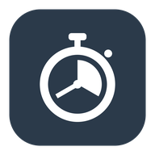
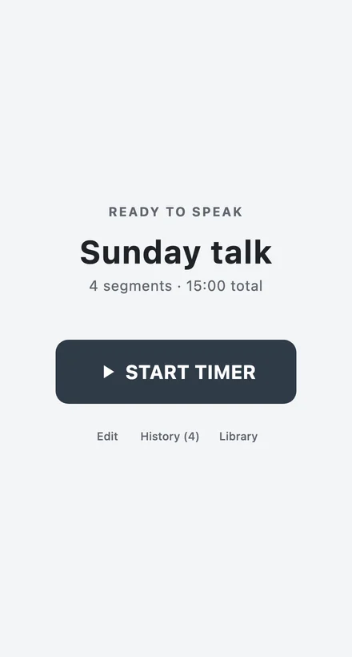
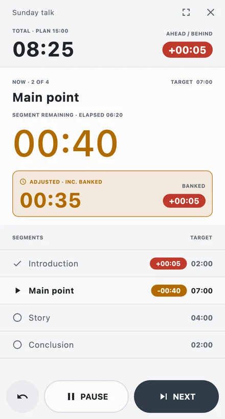
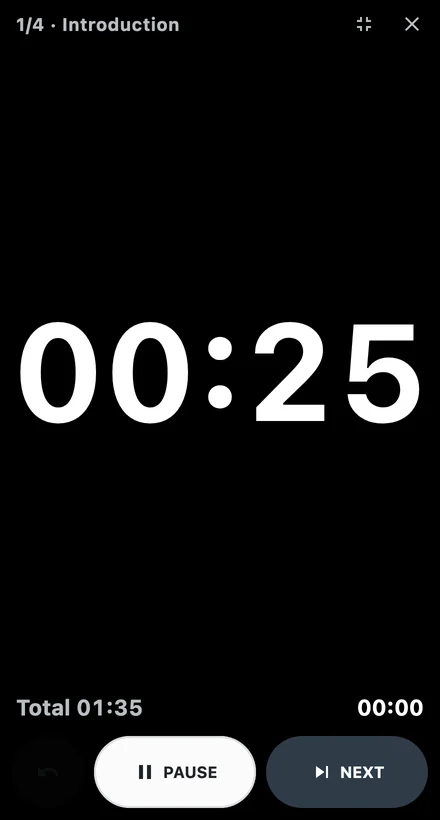
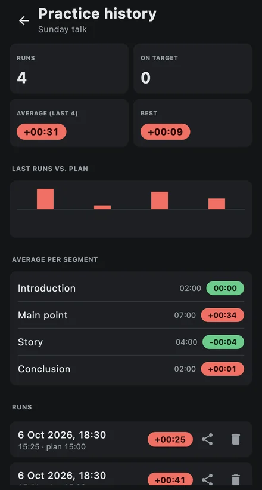

  

<h1 align="center">Speech Split</h1>

  A speech timer that splits your talk into parts, so you always know whether you're ahead or behind. 
  Free for <b>Windows</b>, <b>Android</b> and the <b>web</b> (iPad, Mac and any browser). No ads, no account.

  <a href="https://github.com/dylanmeschner/SpeechSplit/releases/latest/download/SpeechSplit-Setup.msi"><b>Download for Windows</b></a> ·
  <a href="https://github.com/dylanmeschner/SpeechSplit/releases/latest/download/SpeechSplit.apk"><b>Download for Android</b></a> ·
  <a href="https://dylanmeschner.github.io/SpeechSplit/app/"><b>Open in the browser</b></a>

  <a href="https://dylanmeschner.github.io/SpeechSplit/">Website</a> ·
  <a href="https://github.com/dylanmeschner/SpeechSplit/releases">Patch notes</a> ·
  <a href="https://dylanmeschner.github.io/SpeechSplit/privacy.html">Privacy</a>

  
  
  
  

## What it does

Most speech timers only count down the whole talk. Speech Split keeps an eye on every part of it.

1. **Split your speech.** Add the parts of your talk and give each one a time, like 2:00 for the introduction.
2. **Speak with one tap.** Tap Next when you move on. You see what's left of this part and of the whole talk.
3. **Get better each time.** Every run is saved, so you can see where you keep running over.

## Features

- **Ahead or behind:** time you save early carries over to later parts.
- **Import your speech:** drop in a PDF, Word or text file, and segments and times are suggested from your headings and word count.
- **Practice history:** averages per part, a chart of your latest runs, and suggestions where you keep running over.
- **Big clock:** a full-screen, high-contrast clock you can read from a distance.
- **Sort and archive:** sort by last used, newest or name, and archive old speeches without losing them.
- **Keyboard and presentation clicker** on Windows and in the browser: Page Down for next, Space to pause.
- **Smartwatch buzz and Do Not Disturb** while you speak (Android).
- **Calm by design:** light and dark mode, no sounds, gentle colour alerts. And confetti when you land exactly on time.
- In **English, Norwegian and German**.

## Install

**Windows 10 and 11:** download `SpeechSplit-Setup.msi` and open it. If Windows says "Windows protected your PC", click **More info** and then **Run anyway**. You only need to do this once.

**Android 7 and newer:** download `SpeechSplit.apk` and open it. The first time, Android asks you to allow installing from your browser or files app. Allow it, then tap **Install**.

**iPad, Mac and other devices:** open the [web version](https://dylanmeschner.github.io/SpeechSplit/app/). On iPad, tap **Share** and then **Add to Home Screen**, and it works like an app, offline too.

The apps tell you when a new version is out, and you can update with one tap.

### Why is there no App Store app?

An app on the App Store costs $99 every year in Apple developer fees, even when the app is free. The web version is the free way to get Speech Split on iPad and Mac. It does everything the apps do, except the smartwatch buzz and Do Not Disturb, which a browser isn't allowed to control.

## Privacy

Speech Split doesn't collect any data. Your speeches and history stay on your own device, and documents you import are never uploaded. The only thing the apps fetch from the internet is the latest version number and patch notes from GitHub. Read the full [privacy policy](https://dylanmeschner.github.io/SpeechSplit/privacy.html).

## Feedback

Found a bug, or have an idea? Use **Send feedback** in the app (Settings → About), [open an issue](https://github.com/dylanmeschner/SpeechSplit/issues), or email [dylan123@live.no](mailto:dylan123@live.no).

---

Made by Dylan Scott Meschner. Speech Split is free to use and comes without any warranty. See the [terms](https://dylanmeschner.github.io/SpeechSplit/privacy.html).
